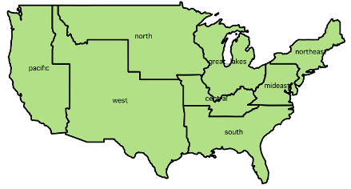

**Custom Regions Map Visualziations**

Custom Regions is a map visualization for use in [Zoomdata](http://www.zoomdata.com).  This visualization allows administrators to create a new chart with map regions to match their organization's data, area, and business processes.

As of version 2.3 the map visualizations in Zoomdata are only available for global countries, or for U.S. data at state, county, and zip code level.  The underlying data must have fields with names and values that match the existing code.  Administrators can use Chart Studio to create their own map visualization.  This sample does that, abstracting the region configuration information to make it easy to specify new regions.

This custom visualization makes it easier for customers to create a map visualization in Zoomdata that uses customer specific map data.  Customers may have data sources with different fields, be interested in different parts of the world, use regions not defined by political boundaries, or a host of other configurations.

The regions map chart works by taking an aggregation in Zoomdata based on a field, where that field contains some region name.  The map finds a polygon with the same region name and colors it based on the associated metric.  For example, your data has a list of sales, each sale has an associated sales region name.  Something like

| sale | item | sales_region |
|---|---|---|
|200.00 | ostrich | northeast |
|50.00 | ocelot | midwest |
|300.00 | otter | south |
|300.00 | otter | northeast |

You need to have a GeoJSON that defines the polygons, and each polygon has an attribute.  The name of the attribute field does not have to be the same, but the _values_ must correspond to the data (case sensitive).  For our animal sales data we could have regions like this:

When displayed in Zoomdata the map would color the northeast region based on 2 rows, the central and south regions based on 1 row, if using Volume as the metric.  Or, it could color the same regions based on the sum of sales.

There are some edge cases that are not quite handled by this map.  The data may have values that don't have any match in the GeoJSON attributes.  This data would not be displayed at all.  This situation potentially affects the overall map, as the visualization limits the number of returned values from Zoomdata as the total number of polygons.

Installation instructions are in the [docs folder](./docs/Home.md)

# For More Information #
Documentation on [creating a custom visualization](http://docs.zoomdata.com/creating-a-custom-chart-template)

Contact [Zoomdata](http://www.zoomdata.com).
