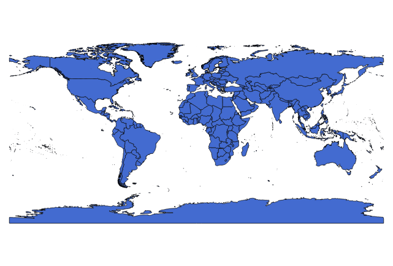
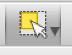
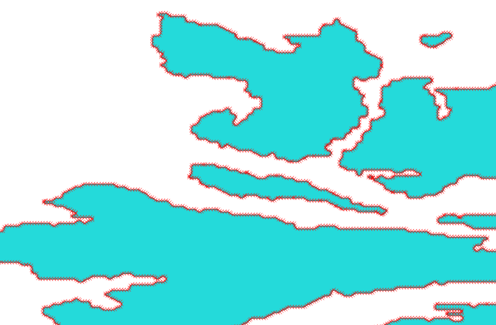

# Creating Map Data for Zoomdata Custom Regions Chart
Now that we have a customizable map chart you will probably want to add your business specific polygons. These instructions provide some basic steps to convert a shapefile, a commonly available format, into GeoJSON.  GeoJSON is a standard format, see [geojson.org](http://geojson.org/) for more information.

Geographic Information Systems (GIS) is a complex domain; dealing with digital geographic data is a science unto itself.  These instructions are intended as a starting point for simple data conversions.  More complex data issues will need the support of a GIS professional.

# GeoJSON

For this example we will use the [Global Administrative Areas](http://www.gadm.org/version2) dataset.  Download the [entire world as shapefile, disolved by level](http://biogeo.ucdavis.edu/data/gadm2.8/gadm28.shp.zip), this file is 844MB, so go get a coffee or something.

Unzip the downloaded file to a folder on your local workstation. The expanded file will create a new folder called "gadm28_levels.shp".  This folder with the ".shp" extension will confuse the application we use, rename the folder, removing the ".shp" from the folder name.

Let's assume that our source data set uses 2 letter ISO standard codes for countries.  This is different than the stock Zoomdata world countries chart, which uses the country full name.  The GADM file provides several shapefiles, administrative boundaries at level 0 (countries), level 1 (state/province), etc.  For this tutorial we will only be using the level 0 shapefile.

Note that "shapefile" is misleading when it comes to the format.  A "shapefile" is actually made up of multiple files on the hard drive.  If you decide to copy the shapefile to a different location make sure to get all files with the same root name and any extensions.

Now that we have our source data you will need a tool to convert the data to a new format.  There are many tools available, both commercial and open source, both application and command-line.  For this tutorial we use the open-source [QGIS](http://www.qgis.org) application (and possibly have another coffee), which provides many features for manipulating geospatial data.  Download and install QGIS according to the instructions on the QGIS site.

Set up a project with the initial dataset for this tutorial:
* Open QGIS, create a new project
* Go to the Layer | Add Layer | Add Vector Layer menu
* In the dialog click "Browse" and navigate to the location where you unzipped the GADM dataset
* select "gadm28_adm0.shp"

You should see the world map, similar to below (the fill color may be different)

Now export the file to GeoJSON:
* In the layers panel in QGIS, right-click on the "gadm28_adm0" layer
* Select the "Save As..." menu option
* In the dialog box change the "Format" to "GeoJSON"
* In the "Save as" text box click "Browse", select a folder and enter "gadm28_adm0_export1.geojson" as the file name and click "Save"
* Click OK in the save as dialog box
* Wait (another coffee?  You may want to switch to decaf...)
Leave QGIS open, we'll use it in the next sections.

# GeoJSON File Size Issue

An issue with GeoJSON is file size.  The file size can rapidly increase to unusable levels.  For example, look at the results of the file we just created: **1.44 GB** _Wow!_

This file will be added as a Javascript library to the visualization, so the browser will download this file every time the visualization comes up.  For larger files the browser will not be able to handle the file, or timeout waiting for the download.  Time for a diet!

There are some steps that can be taken to mitigate the file size.
* Simplify the data, removing unused fields and polygons
* Simplify the geometry, reducing the number of vertices in the data
* Change the file format to something that reduces redundancy

In QGIS right-click the "gadm28_adm0_export1" layer and select "Remove" and click "OK" in the confirmation dialog box.

## Simplify the Source Data

The Custom Regions Visualization requires each polygon have at least one property, a name or other ID that matches the data coming from Zoomdata.  Frequently the source data includes many other properties.  These properties are useful for spatial analysis problems, but not needed for our chart.  Additionally there may be polygons that will never be used.  For example, if our data is only over European countries then we don't need to show the rest of the world.

To remove un-needed features we will need to edit the shapefile.  First, make a copy of the data so we don't have to re-download the entire GADM dataset again, then remove Antarctica, as that is not referenced in our data.  Finally, we'll remove the attributes that won't be used.

* In the QGIS table of contents right-click on the original "gadm28_adm0" layer and select "Save as..."
* This time select specify the format as "Esri Shapefile" and name the file "adm0_simplify1.shp"
* Wait... again...
* In the layers panel right-click on the new "adm0_simplify1" layer and select "Toggle Editing" from the context menu
* On the toolbar click the "Select areas by feature or single click" button

* Click somewhere in Antarctica on the map
* Select the Edit | Delete Selected menu option.  Thousands of penguins are now displaced, good job.  You may still see the Antarctica shape on the map, the original gadm28_adm0 shape is visible underneath the one we are working with
* Right-click on the "adm0_simplify1" layer in the layers panel and select "Open attribute table"
* Press "CTRL-L" to open the Delete Field dialog
* Select the "ID_0" field and click OK
* Repeat the delete field for almost all of the other fields, *keeping only "OBJECTID" and "FIPS" fields in the data*.  You can select multiple fields in the dialog by holding down shift while clicking field names
* Close the attribute table
* In the layers panel right-click "adm0_simplify1" and click "Toggle Editing" in the context menu; click "save" in the confirmation dialog

Follow the instructions from the previous section to right-click, Save as..., GeoJSON.  Name the file "gadm28_adm0_export2".

The resulting file is smaller, **1.39 GB**, but that is still way to big.  This technique may be sufficient for some data sets, but not this one.  The real issue for this data set is the number of points that make up the polygons.

## Simplify the Source polygons
Polygons can be very detailed.  Since polygons in GeoJSON are represented as a list of coordinates this detail translates into increased file size.  This image shows a zoomed-in view of the GADM28 administrative boundaries level 0 on the coast of Norway; each red X represents a vertex in the polygon.

For country level data used in Zoomdata this level of detail may be excessive.  Users of the chart will probably not zoom in this close, as the idea is to compare between countries.  Applying a simplification algorithm to the polygons can reduce the number of vertices.  There are a few tools that will help you simplify your polygons.  

QGIS includes a tool to simplify geometries.  However, the process is a bit involved.  I have some [instructions](./polygon_simplification_in_qgis.md) available, but the Mapshaper method (below) is much easier.

[mapshaper](http://mapshaper.org) provides some simple, interactive tools for simplifying polygons and creating TopoJSON.
* Open a browser page to http://mapshaper.org
* Either open your GeoJSON file from the dialog or drag it from your file system and drop it on the window
* On the tool bar in the upper left there is an option for "Simplify"
* A dialog appears with multiple options.  You can stick with the defaults for now and come back later to experiment with the different simplification algorithms to determine the best one for your data
* A slider bar appears at the top.  Adjust the slider to a lower percent and evaluate when the polygons start to deteriorate past the desired appearance.  Zoom in on detail areas to get a good perspective of the changes.  For example, if polygons start separating where they used to touch that might be too much simplification
* Once you have the simplification set the way you want it click "Export" on the left side of the toolbar.  Select either "GeoJSON" or "TopoJSON".  TopoJSON will be smaller for dense polygon collections where the polygons share borders

# Convert the JSON to a Javascript object
The Custom Regions chart expects the polygons to be in a Javascript object, not a JSON file.

* Open the file in a text editor and add `var countries = ` at the start (change `variableName` to a variable name appropriate for your data).  This makes the JSON into a Javascript object that can be ingested by the custom visualization code
* Rename the file "gadm28_adm0_simplified.js"
* Follow the instructions for [customizing the custom regions custom visualization](./customizing_the_map.md)

Congratulations, you've created a polygon file to use with Zoomdata!  Celebrate with _another_ coffee, or something **stronger**!
