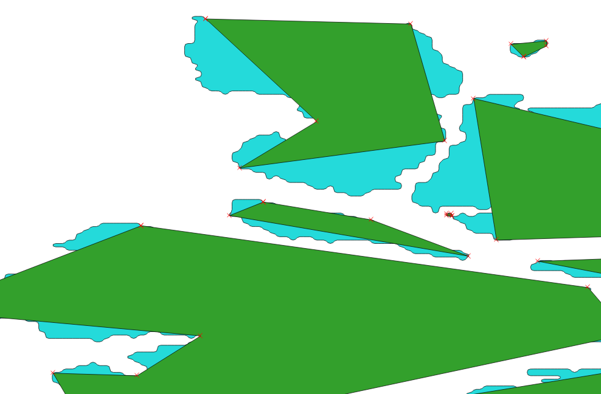
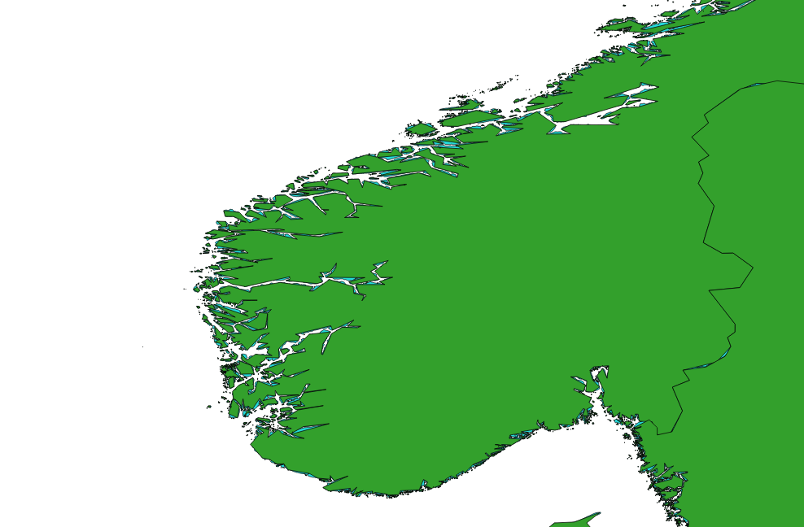

First, remove our working files from QGIS. Right click on "adm0_simplify1" in the layers panel, click "Remove" on the context menu and "OK" in the confirmation dialog.  Repeat for "gadm28_adm0_export2".  Now use the QGIS geometry simplification tool:

* In QGIS select the Vector | Geometry Tools | Simplify geometries menu
* In the Simplify geometries dialog make sure the "Input layer" is set to "gadm28_adm0[EPSG:4326]"
* Set the tolerance.  This is the magic parameter that determines the amount of vertices to remove.  

The result is a layer that is much less detailed.  Below you see the new, simplified layer (green) over the original, detailed layer (blue).

While this looks significant, this image is zoomed in to a very detailed level.  Zoomed out a bit further shows that the polygons are acceptable for a high-level view of countries.

The overall outline of the country is still recognizable, with a significant savings in file size.

It is up to you to judge if the sacrifice of detail is acceptable.  The parameters for the simplification can be adjusted to remove fewer verticies, with a corresponding file size penalty.

## Convert to TopoJSON
You can use [Mapshaper](http://mapshaper.org) to convert to TopoJSON as described [here](./creating_geojson.md), or use the TopoJSON command line utility.

TopoJSON is an alternate representation of the polygons, still in a JSON format.  At a high level the format identifies the lines as individual items, then assembles polygons using references to the lines.  Shared borders are only represented once, eliminating redundancy in the data file, decreasing file size.  Details of the format are available on the [TopoJSON Wiki Page](https://github.com/topojson/topojson/wiki).

Creating a TopoJSON requires a GeoJSON file for input.  Follow the instructions above to create a GeoJSON, performing additional simplification steps to further reduce the file size if appropriate.  Then use the TopoJSON command line utility to convert the file.
